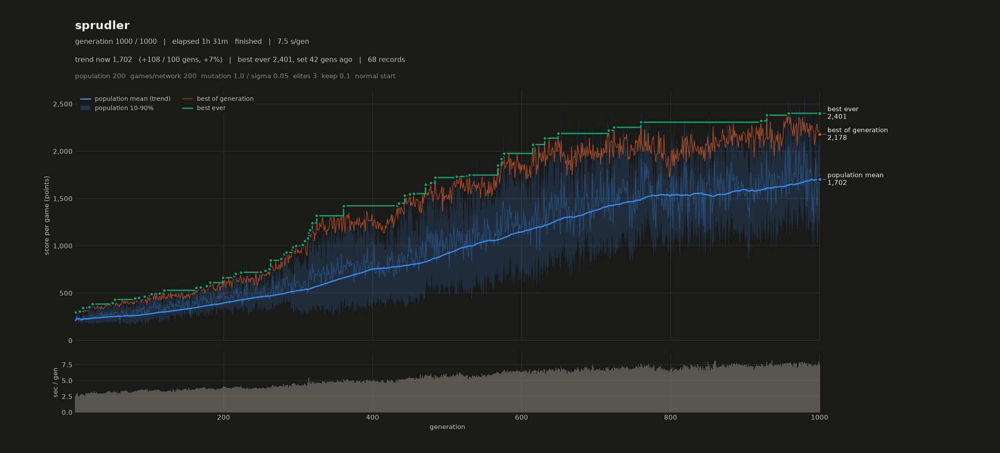

# tensorNetwork

My learning project: a neural network written from scratch on raw PyTorch tensors, trained by evolution instead of backpropagation, now learning to play [SprudelJump](https://github.com/JoblessJoe/sprudelJump), my Doodle Jump clone.



## What's in here

- **`network.py`**: the network. A list of `(weights, bias)` tensor pairs, ReLU hidden layers, sigmoid output, and a batched forward pass that runs a whole population at once. No `torch.nn` modules, only its weight initialisers.
- **`training.py`**: the evolutionary loop: build a population, score it, keep the best, mutate (optionally cross over), repeat.
- **`inCircleNN.py`**: first test. Learn whether a point lies inside a circle.
- **`frogDetector.py`**: second test. Frog vs not-frog on CIFAR-10.
- **`proSprudler.py`**: the SprudelJump trainer. Every network plays a few hundred seeded games per generation, in parallel on all CPU cores.
- **`nightRun.py`**: queues overnight experiments and benchmarks the results.
- **`evalModel.py`**, **`plotRun.py`**, **`monsterDeaths.py`**, **`stressCheck.py`**: fixed 200-game benchmarks, learning curves, death analysis, and a check that the CPU undervolt never changes results.

## Where it stands

- **Goal:** ~100,000 points per game.
- **Best so far:** ~8,400 from the start, ~4,100 from a hard start.
- **What helped:** a better observation (fixed-meaning input slots), less noise in selection (more games per network, common random numbers, rank selection), careful mutations for polishing, and a numba-compiled game that runs many games in lockstep.
- **What didn't:** wider or deeper networks, more inputs, a difficulty input, monster-heavy practice.
- **Next:** monster timing inputs (monsters cause 40–50% of deaths), more games per network, a shrinking mutation size, Evolution Strategies.

`AGENTS.md` holds the full experiment log; `plan.md` holds my own notes from the start.

## How I learn

I write the code myself. AI is my tutor, not my author: `learningContract.md` sets the rules — explain concepts with unrelated examples, let me explain my understanding back, validate or nudge, no copy-paste fixes for my own code. AI helps with benchmarking, analysis and tooling.

## Run it

Python 3.10+, `torch`, `numpy`, `numba`, `matplotlib`, `tqdm`; [SprudelJump](https://github.com/JoblessJoe/sprudelJump) checked out next to this repo.

```bash
python proSprudler.py                                         # train (settings in __main__)
OPENBLAS_NUM_THREADS=1 python evalModel.py models/<x>.pt --stable --smoothing 0.5 --fast
cd ../sprudelJump && python demo_render.py --model ../tensorNetwork/models/<x>.pt --stable --smoothing 0.5
```

Trained on my home rig: Ryzen 9 7950X (31 parallel workers, ~2.4 s per generation at 200 games), RTX 2080 Ti, 32 GB DDR5.
